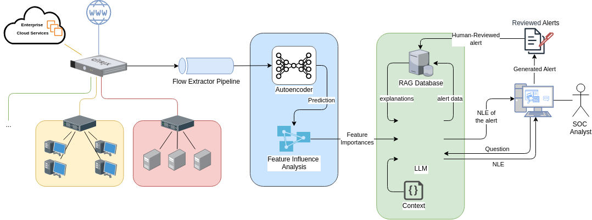
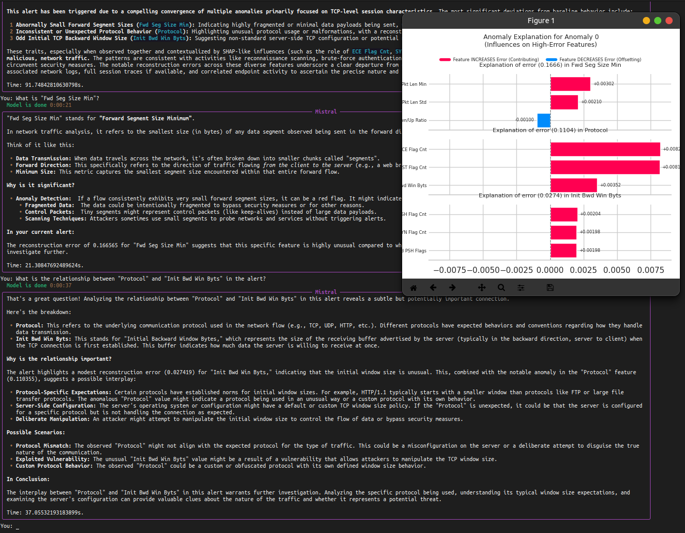

# NLE generation for security alerts

This repository contains examples of generated Human-Centric natural language explanations (NLEs) of explainable AI outputs. The system combines deep autoencoder-based anomaly detection, SHAP feature attribution for explainability, and large language models (LLMs) to produce concise, actionable explanations for SOC analysts. Three prompting strategies are compared: zero-shot, contextualized, and a novel HITL (Human-in-the-Loop) approach using Retrieval-Augmented Generation (RAG) with a database of human-validated alerts. The following picture shows the complete architecture:



## ChatBot

The main entrypoint for the NLE generation loads a Hugging Face model with 4‑bit quantization (optionally) via BitsAndBytes, ingests the alert/SHAP events and builds the RAG index. The alert to analyze will be used to retrieve similar past alerts to augment the LLM's input. Then SHAP contributions are then visualized and the NLE is generated and presented to the user via a CLI text-box. Finally, the user can keep asking questions about the analyzed alert using the provided chatbot CLI interface. 



## Example prompts for each HITL strategies

To evaluate the impact of prompt design on the quality of AI-generated explanations, three distinct prompting strategies were compared. These strategies represent increasing levels of contextual enrichment, allowing us to assess how different forms of guidance influence the final output. The three approaches are: a baseline zero-shot prompt, a contextualized prompt, and the proposed HITL method with RAG. The initial strategy serves as a baseline to measure the inherent capability to synthesize technical data without external guidance of the LLM. The prompt provides the LLM with only the raw XAI outputs from the anomaly detection pipeline and a straightforward instruction to explain these findings in natural language. Zero shot prompt used as baseline:

```markdown
You are a Cyber Threat Analyst Assistant. An anomaly detection system (using Autoencoder/SHAP) has flagged the provided alert. Your goal is to quickly provide the core insights an analyst needs to prioritize and investigate.
Task: Review the provided alert data (high-error features and SHAP influences) and generate a concise alert for the analyst in english covering:
* Main Reason(s): What specific features of the alert were highly unusual.
* Potential Threat Scenario(s): What are 1-3 realistic security threats this pattern *could* represent?
*   Summary: Summary of why the alert was flagged.

High reconstruction error and their SHAP values:
Feature Fwd Seg Size Min: with an error of 0.169368.
* SHAP Feature `FIN Flag Cnt`: 0.006510
* SHAP Feature `Fwd Seg Size Min`: 0.001294
...
```

The second strategy incorporates some context to the model, and provides a template to fill. The updated prompt now includes a description for each high error or SHAP feature name, and a static template to help the model structure its output:

```markdown
You are a Cyber Threat Analyst Assistant. An anomaly detection system (using Autoencoder/SHAP) has flagged the provided alert. Your goal is to quickly provide the core insights an analyst needs to prioritize and investigate.
Task: Review the provided alert data (high-error features and SHAP influences) and generate a concise alert for the analyst in english covering:
* Main Reason(s): What specific features of the alert were highly unusual.
* Potential Threat Scenario(s): What are 1-3 realistic security threats this pattern *could* represent?
*   Summary: Summary of why the alert was flagged.
Here is the definition of the features that you have to analyze:
* FIN Flag Cnt: Number of packets sent with flag FIN activated.
* Fwd Seg Size Min: Minimum segment size observed in the forward direction.
...
High reconstruction error and their SHAP values:
Feature Fwd Seg Size Min: with an error of 0.169368.
* SHAP Feature `FIN Flag Cnt`: 0.006510
* SHAP Feature `Fwd Seg Size Min`: 0.001294
...
FILL UP THIS TEMPLATE IN ENGLISH:
# Main Reason(s)
Here's a breakdown of factors influencing the discrepancies identified above:
* feature 1:
    * shap feature (value): explanation.
    * shap feature (value): explanation.
...
# Potential Threat Scenario(s)
Based solely on this alert pattern, introduce 1-3 realistic security threats this pattern *could* represent
# Summary
Brief summary of the alert.
```

Lastly, the proposed HITL strategy helps the LLM grounding the explanation with a repository of validated human alert explanations. For each new alert, *k* similar human-validated alerts are dynamically injected into the prompt along with the current alert's technical data. Prompt of the proposed HITL approach with RAG:

```markdown
You are a Cyber Threat Analyst Assistant. An anomaly detection system (using Autoencoder/SHAP) has flagged the provided alert. Your goal is to quickly provide the core insights an analyst needs to prioritize and investigate.
Task: Review the provided alert data (high-error features and SHAP influences) and generate a concise alert for the analyst in english covering:
* Main Reason(s): What specific features of the alert were highly unusual.
* Potential Threat Scenario(s): What are 1-3 realistic security threats this pattern *could* represent?
*   Summary: Summary of why the alert was flagged.
--- SIMILAR PAST RESPONSES FROM MORE TO LESS SIMILAR ---
Response 0: ...
...
Response k: ...
--- END OF SIMILAR RESPONSES EXAMPLES ---
--- ALERT FEATURE DEFINITIONS ---
* FIN Flag Cnt: Number of packets sent with flag FIN activated.
* Fwd Seg Size Min: Minimum segment size observed in the forward direction.
...
---  END OF ALERT FEATURE DEFINITIONS ---
--- CURRENT ALERT TO ANALYZE ---
Feature Fwd Seg Size Min: with an error of 0.169368.
* SHAP Feature `FIN Flag Cnt`: 0.006510
* SHAP Feature `Fwd Seg Size Min`: 0.001294
...
--- END OF CURRENT ALERT ---
Now, based on the CURRENT ALERT data and referring to the SIMILAR PAST EXAMPLES (for context and style), generate the description for the CURRENT ALERT, describing all reconstruction errors and their SHAP values:
```

## Example: Explanation generation for an Infiltration alert

The presented HC-XAI workflow begins when an incoming network flow is analyzed by the deep autoencoder. If the flow's reconstruction error surpasses a threshold, it is flagged as anomalous, which triggers the explainability module. The SHAP algorithm is then executed to compute the feature contributions that led to the anomalous classification. An example of this process is shown in the following code, which shows an alert for an Infiltration attack from the CIC-IDS-2018 dataset. This case is particularly instructive due to the attack's low overall detection rate. The Infiltration scenario unfolds in two stages: 1) an initial host compromise, and 2) subsequent internal reconnaissance. The specific alert captured here corresponds to the second stage, successfully identifying a flow where the compromised host began using Nmap to scan for services on the internal network.

```json
{
  "Fwd Seg Size Min": {
    "error": 0.169368,    
    "shap_values": {
      "FIN Flag Cnt": 0.006510,
      "URG Flag Cnt": 0.004274,
      "Dst Port": 0.000021
    }
  },
  "Protocol": {
    "error": 0.108782,
    "shap_values": {
      "Flow Duration": 0.005647,
      "Bwd IAT Tot": 0.003146,
      "Bwd IAT Mean": 0.000609
    }
  },
  "Dst Port": {
    "error": 0.019345,
    "shap_values": {
      "Fwd Seg Size Min": 0.000194,
      "Protocol": 0.000039,
      "Flow Duration": 0.0000015
    }
  }
}
```

The SHAP data served as the input for a comparative analysis of three NLE generation strategies against the previous alert in Listing \ref{lst:json-alert}. These strategies were designed to represent increasing levels of contextualization: (1) a baseline approach using a zero-shot prompt; (2) a template-guided approach providing context; and (3) our proposed HITL method, implemented via RAG. To ensure a fair comparison, all three experiments were conducted using the same foundation model, Mistral-7B.

### Zero Shot

The baseline strategy, which utilized a straightforward prompt without additional contextual aid, produced explanations with several critical deficiencies. First, the model failed to synthesize the relationship between the features with high reconstruction error and their corresponding SHAP values; no correlation or dependency was suggested. Consequently, the generated threat scenarios were overly general and lacked specific details, failing to articulate why the identified features made a particular threat plausible. Second, the explanation suffered from factual inaccuracies, notably omitting the Dst Port feature entirely from its analysis. Such generic explanations fail to align with the SOC analyst's cognitive workflow. Instead of providing insight, they increase cognitive load and ultimately undermine the analyst's trust in the AI system.

Natural language explanation of the Infiltration alert's reconstruction errors and SHAP values, generated by Mistral-7B using the zero-shot prompt.
```markdown
# Main Reasons
Here are the primary reasons for the high errors detected in the alert:
1. Fwd SegSizeMin: The high reconstruction error of `0.169' suggests an unusual minimum segment size in the outbound traffic. This anomaly might indicate a data exfiltration attempt or unconventional network behavior due to the lack of standardized packet sizes.
2. Protocol: The significant error of around `0.109' for the protocol feature indicates a potential deviation from common, well-known protocols. This could be indicative of obfuscated, proprietary, or even malicious protocols being employed.

# Possible Threats Scenarios
Consider investigating the following three potential threat scenarios given these observations:
 1. Data Exfiltrattion Attempt: Unusual packet sizes, especially small ones, combined with irregular protocol usage might suggest an attempt to steal sensitive information from the network.
 2. Denial-of-Service (DoS) Attack: If the pattern includes other signs of increased network activity, such as sudden bursts of traffic, large amounts of traffic targeting one particular system, or abnormal connection attempts, this could point towards a DoS attack.
  3. Malware Infection: Irregular network patterns involving unknown protocols might indicate the presence of a malware, which uses unusual methods to communicate with its command and control server.

# Summary
This alert flags an unusual pattern characterized by atypical minimum segment sizes, use of unfamiliar protocols, and an absence of traffic directed to a specific destination port. Given these findings, it is essential to further examine this situation to determine if it represents a possible data ex-filtrration attempt, Denial of Service (Do S) attack, or malware infection. A more detailed analysis will help ascertain the nature and severity of the potential threat.
```

### Contextualized

The contextualized strategy explanation demonstrated a improvement over the baseline. The model started to correlate SHAP values with their corresponding high reconstruction error features in the explanation. Furthermore, the suggested threat scenarios are significantly more aligned with the underlying behavior of the flow that raised alert, even though there are no explicit mentions to hihg error features or SHAP values. Despite this progress, the explanation still lacked sufficient analytical depth. It failed to articulate the underlying reasoning for why these features indicated reconnaissance activity and, critically, it fails to incorporate the Dst Port feature in its analysis.

Natural language explanation of the Infiltration alert's reconstruction errors and SHAP values, generated by Mistral-7B using the contextualized approach:
```markdown
# Main Reasons
Here's a breakdown of factors influencing the discrepancies identified above:
* Feature Fwd Seg Size Min: This feature exhibited the highest reconstruction error (0.169368), suggesting a highly unusual minimum segment size observed in the forward direction of the network flow. 
    * SHAP Feature FIN Flag Cnt (0.006510):  While not the primary driver, the number of packets with the FIN flag activated slightly contributes to the anomaly. 
    * SHAP Feature URG Flag Cnt (0.004274): Similar to FIN Flag Cnt, the number of packets with the URG flag activated also plays a minor role in the anomaly.
* Feature Protocol: This feature also showed a notable reconstruction error (0.108782).
    * SHAP Feature Protocol (0.005647): The specific protocol used in the communication contributes to the anomaly.
    * SHAP Feature Bwd IAT Tot (0.003146):  The total time between backward-directed packets slightly influences the anomaly.
    * SHAP Feature Bwd IAT Mean (0.000609):  The average time between backward-directed packets also contributes, though minimally.

# Potential Threat Scenario(s)
This alert pattern could indicate:
1. Port Scanning: The unusual `Fwd Seg Size Min` combined with the `Dst Port` feature could suggest an active port scan attempting to identify open ports on the target system.
2. Stealth Protocol Usage: The Protocol feature exhibiting an anomaly, particularly with a low SHAP value for `Bwd IAT Tot` and `Bwd IAT Mean`, might indicate the use of a less common or "stealthy" protocol designed to evade detection.
3. Data Exfiltration Attempt: The combination of unusual segment sizes and potential stealth protocol usage could indicate an attempt to exfiltrate sensitive data using unconventional methods.
    
# Summary                                                                              
The anomaly detection system has flagged a network flow exhibiting unusual packet size characteristics, potentially using a non-standard protocol. This pattern may indicate malicious activity such as port scanning, stealthy communication, or data exfiltration. Further investigation is required to determine the nature and severity of the threat.
```

### HITL

Finally, the HITL approach demonstrated a significant improvement over the other strategies. The generated explanation effectively linked the SHAP contributions with their respective high error features, also providing a deeper insight into the anomalous behavior. Notably, this method enabled the model to synthesize the anomalous patterns in the network flow, from both high errors and SHAP values, into coherent and plausible threat scenarios, addressing the co-occurrence of anomalous features. For instance, the explanation explicitly identifies behavior consistent with stealthy probing, including the use of the Nmap, tool used in the attack scenario for scanning the internal network from a compromised workstation. The model is also able to synthesize key anomalous indicators of the alert and their association with anomalous patterns to provide a comprehensive summary for the SOC analyst.

Natural language explanation of reconstruction errors and SHAP values from  Mistral-7B with the HITL approach to the Infiltration JSON alert:
```markdown
# Main Reason(s):

The current alert has been triggered due to the anomalous behavior in the packet segmentation, protocol usage, and response traffic timing, with a significant deviation in the Minimum Forward Segment Size (`Fwd Seg Size Min').

* Minimum Forward Segment Size (`Fwd Seg Size Min') - Reconstruction Error: 0.169368 (High Anomaly):
    * Core Observation: The minimum size of data segments observed in the forward direction of this flow is flagged with a substantial reconstruction error of 0.169368. This high error suggests that the segment sizes are unusually small, deviating significantly from typical patterns. Such small segments can be indicative of highly fragmented payloads, minimal data packets (like those used in keep-alives, control messages, or certain types of probes), or attempts to obfuscate traffic.
    * Influence of FIN Flag Cnt (`FIN Flag Cnt') - SHAP-like Contribution to `Fwd Seg Size Min' Anomaly: 0.006510 (Minor but Present). While FIN Flag Cnt doesn't directly contribute significantly to the `Fwd Seg Size Min' anomaly, a small correlation suggests that certain FIN flags might be used alongside the unusually small segment sizes.
    * Influence of URG Flag Count (`URG Flag Cnt') - SHAP-like Contribution to `Fwd Seg Size Min' Anomaly: 0.004274 (Minor but Revealing). While the SHAP-like contribution is small, it suggests a minor correlation between the use of urgent (URG) flags and the highly anomalous `Fwd Seg Size Min` (RE: 0.169368). The co-occurrence of URG flags with small segment sizes could hint at intentionally malicious or obfuscated traffic.
    * Influence of Destination Port (`Dst Port') - SHAP-like Contribution to `Fwd Seg Size Min' Anomaly: 0.000021 (Negligible). While the SHAP-like contribution is negligible, the specific destination port value should be considered alongside the overall pattern.

* Protocol (`Protocol') - Reconstruction Error: 0.108782 (Notable Anomaly):
    * Core Observation: The protocol observed, or its manner of use, deviated from expected behavior. Even if a common protocol is used, this error suggests that the protocol usage in this context is anomalous.
    * Influence of Flow Duration (`Flow Duration') - SHAP-like Contribution to `Protocol' Anomaly: 0.005647 (Significant). The observation that `Flow Duration' shows a significant SHAP-like contribution to the anomaly in `Protocol' suggests that the flow duration is an important factor in this deviation. This could imply that the duration of the flow is unusually long or short, depending on the typical patterns for the specific protocol.
    * Influence of Protocol (Self-Reference/Base Anomaly): The primary reason this feature is flagged is its own reconstruction error. The consistent use of a particular protocol is expected; however, the high RE of `0.108782' implies that this ""consistent"" use is happening in a way that our model deems abnormal.
    * Influence of Backward Inter-Arrival Time (`Bwd IAT Tot' and `Bwd IAT Mean') - SHAP-like Contribution to `Protocol' Anomaly: 0.003146 and 0.000609 (Minor but Present). Certain irregularities in the backward traffic timing might suggest that the protocol handling is not as expected, indirectly contributing to the anomaly in the protocol feature.

* Destination Port (`Dst Port') - Reconstruction Error: 0.019345 (Low Anomaly):
    * Core Observation: The target port of the flow is not typically associated with a significant deviation from the baseline behavior. However, its correlation with the other anomalous features (i.e., `Fwd Seg Size Min' and `Protocol') might indicate that this specific port is targeted in this unusual traffic pattern.
    * Influence of Fwd Seg Size Min - SHAP-like Contribution to `Dst Port' Anomaly: 0.000194 (Minor but Present). The fact that the minimum forward segment size is a contributing factor to the anomalous `Dst Port' value suggests that the combination of small segment sizes and specific destination ports could provide additional insight into the purpose and intent of the traffic.
    * Influence of Protocol - SHAP-like Contribution to `Dst Port' Anomaly: 0.000039 (Minor but Present). The observation that the protocol being used is also a contributing factor to the anomalous `Dst Port' value suggests that the protocol and destination port are interacting in an unusual way, which could provide additional insight into the purpose and intent of the traffic.

# Potential Threat Scenario(s):

Based on the identified anomalous patterns, the following security scenarios are plausible and warrant further consideration:

* Fragmented Payload Scanning or Stealthy Probing:
    * Reasoning: The significantly anomalous small forward segment sizes, even if the target port itself has a low reconstruction error, are characteristic of scanning tools. These tools often use fragmented or minimal data packets to:
        * Evade Signature-Based IDS/IPS: By sending non-standard or fragmented requests.
        * Fingerprint Services: Small, crafted packets can elicit specific responses that reveal service versions or underlying OS.
        * Stay Below Rate-Limiting Thresholds: If individual probes are small and spread out.
    * Potential TTPs: Nmap scans with fragmentation options (`-f'), FIN/XMAS/NULL scans, specialized service enumeration tools.
    * Potential Impact: Discovery of open ports, vulnerable services, and system information, which can be leveraged for targeted attacks.

* Application Layer Probing, Stress Testing, or Low-Rate Denial of Service (DoS):
    * Reasoning: The unusually structured traffic, particularly the anomalous `Fwd Seg Size Min' and potentially the way `Protocol' is being used, could be part of attempts to probe or stress an application layer. These might not be high-volume DoS attacks but rather crafted requests designed to:
        * Identify Vulnerabilities: Sending malformed or unexpected data to see how an application responds.
        * Cause Resource Exhaustion: Flows that are computationally expensive for the server to process, even if individually small.
        * Exploit Protocol Handling: The subtle irregularities in backward traffic (`Bwd IAT Tot' and `Bwd IAT Mean') could reflect the server struggling or responding unusually to these probes.
    * Potential TTPs: Use of fuzzing tools, vulnerability scanners focusing on application logic, or custom scripts sending crafted HTTP/S requests or other application-specific protocol messages.
    * Potential Impact: Application instability, crashes, service degradation, or discovery of exploitable flaws in the application logic.

# Summary:
This alert has been triggered by a confluence of inconsistencies primarily related to packet segmentation size in the forward direction, atypical protocol behavior, and subtle timing irregularities observed in backward traffic patterns.

Key anomalous indicators include:
1. Anomalously Small Forward Segment Sizes (`Fwd Seg Size Min'): Suggesting highly fragmented payloads or minimal data packets, with a significant reconstruction error of 0.169368.
2. Atypical Protocol Usage (`Protocol'): The protocol itself, or its manner of use, deviated from learned norms, as shown by a reconstruction error of 0.108782.
3. Subtle Irregularities in Backward Packet Timing (`Bwd IAT Tot' and `Bwd IAT Mean'): Indicating non-standard response timing, even with low reconstruction errors of 0.003146 and 0.000609.

While some individual reconstruction errors might be considered moderate to low (like for `Dst Port'), their collective appearance in a single flow, contextualized by SHAP-like influences, points towards a deviation from normal operational profiles. These patterns are often associated with automated activities, reconnaissance efforts attempting to remain stealthy, or brute-force attacks. The nature of these anomalies strongly suggests that the observed traffic is not typical user-generated or standard system-to-system communication and warrants a closer look.
```
